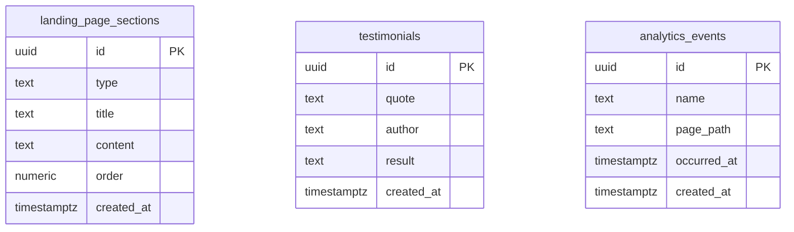

# PRD: 랜딩 페이지 생성

> 📌 Device: **Web (browser)** · 🧠 Coding IDE: **Cubivora**

> Cubivora Spec-First PRD (auto-generated). Treat this document as the single source of truth during implementation.

## 1. One-liner

방문자가 서비스를 빠르게 이해하고 CTA 버튼을 눌러 신청/문의까지 이어지게 하는 랜딩페이지

## 2. Out of scope

- _(none)_


## 3. Target users

- 가구 구매 예정 소비자
- 가구 가격 비교 고객
- 매장 방문이 번거로운 사람


### Target persona — depth

가구 구매를 계획하고 있으며, 자신의 니즈에 맞는 제품을 합리적으로 비교하고 매장 방문을 줄이고 싶은 소비자입니다.

## 3.5 Killer differentiator

가구 가격을 비교해 고객의 니즈에 맞는 제품을 찾고 구매할 수 있도록 도와줍니다.

## 4. Core features

- **[MUST]** 상단 로고 표시 — 페이지 상단에 로고를 표시한다.
  - 🔎 Detail: 로고 애니메이션 효과
  - 🔎 Detail: 반응형 로고 크기
  - 🔎 Detail: 로고 클릭 가능
  - 🔎 Detail: 테마별 로고 전환
- **[MUST]** 모바일/PC 반응형 지원 — 모바일과 PC 환경 모두에서 정상적으로 표시된다.
  - 🔎 Detail: 브레이크포인트 기준 설정
  - 🔎 Detail: 해상도별 이미지 전환
- **[MUST]** 기본 SEO 메타 태그 적용 — 기본 SEO 메타 태그를 페이지에 적용한다.
  - 🔎 Detail: SNS 공유 카드 설정
- **[MUST]** 사용자 후기 섹션 — 실제 사용자의 긍정적인 평가와 결과를 시각적으로 표시하여 신뢰도를 높인다.
  - 🔎 Detail: 실제 사용자의 긍정적인 평가와 결과를 시각적으로 표시하여 신뢰도를 높인다.
- **[MUST]** CTA 버튼 클릭 — CTA 클릭 시 회원가입 또는 서비스 시작 페이지로 이동한다.
  - 🔎 Detail: 클릭 후 이동 경로
  - 🔎 Detail: 버튼 배치 위치
  - 🔎 Detail: 유인 배지, 라벨
- **[MUST]** 방문 및 CTA 클릭 이벤트 측정 — 방문 및 CTA 클릭 이벤트를 측정한다.
  - 🔎 Detail: Google Analytics 연동
  - 🔎 Detail: 에러 페이지로 이동
- **[MUST]** 고객 후기 섹션 추가 — 서비스에 대한 신뢰도를 높이고 구체적인 강점을 시각적으로 전달하기 위해 '고객 후기' 섹션을 추가합니다. 이 섹션에는 세 명의 고객 후기 카드가 포함됩니다. 각 후기 카드는 고객 이름, 5점 만점의 별점, 그리고 한 줄 코멘트로 구성됩니다. 초기 데이터는 다음과 같습니다: - 김지현 님: 별점 5점, "설치 다음 날 바로 문의가 들어왔어요" - 박준호 님: 별점 4점, "디자인이 깔끔해서 신뢰가 갑니다" - 이서연 님: 별점 5점, "문의 폼이 간단해 전환율이 올랐어요" 화면 구성은 PC 환경에서는 세 개의 후기 카드가 가로로

## 5. Screens / URLs

| Route | Page | Purpose |
|-------|------|---------|
| `/hero` | Hero 섹션 | 핵심 가치 제안과 무료로 시작하기 CTA 버튼 표시 |
| `/screen` | 문제 제시 섹션 | 사용자가 겪는 문제를 제시하여 공감 유도 |
| `/screen-2` | 서비스 소개 섹션 | 아이디어 입력부터 기획안 생성까지의 흐름 안내 |
| `/screen-3` | 핵심 장점 섹션 | 쉽게 시작, 빠른 정리, 개발에 활용 등 핵심 장점 전달 |
| `/cta` | 최종 CTA 섹션 | 기획안 만들기 버튼으로 전환 유도 |

## 5.5 Per-feature screens

### 🧩 Screens for the “CTA 버튼 클릭” feature
- 히어로 풀스크린형

### 🧩 Screens for the “상단 로고 표시” feature
- 고정 헤더 바형

### 🧩 Screens for the “사용자 후기 섹션” feature
- 사용자 후기 섹션 화면 — 실제 사용자의 긍정적인 평가와 결과를 시각적으로 표시하여 신뢰도를 높인다.

### 🧩 Screens for the “모바일/PC 반응형 지원” feature
- 풀스크린 스크롤형

### 🧩 Screens for the “기본 SEO 메타 태그 적용” feature
- OG 미리보기 카드형

### 🧩 Screens for the “방문 및 CTA 클릭 이벤트 측정” feature
- 히어로 스크롤 추적형

### 🧩 Screens for the “고객 후기 섹션 추가” feature
- 랜딩 페이지

## 6. Data model

### 6.1 Entities (as captured)

### LandingPageSection
| Field | Type | Required | Description |
|-------|------|----------|-------------|
| id | string |  |  |
| type | string |  |  |
| title | string |  |  |
| content | string |  |  |
| order | number |  |  |

### Testimonial
| Field | Type | Required | Description |
|-------|------|----------|-------------|
| id | string |  |  |
| quote | string |  |  |
| author | string |  |  |
| result | string |  |  |

### AnalyticsEvent
| Field | Type | Required | Description |
|-------|------|----------|-------------|
| name | string |  |  |
| pagePath | string |  |  |
| occurredAt | datetime |  |  |


### 6.2 PostgreSQL schema

```sql
CREATE TABLE landing_page_sections (
  id UUID PRIMARY KEY DEFAULT gen_random_uuid(),
  type TEXT,
  title TEXT,
  content TEXT,
  order NUMERIC,
  created_at TIMESTAMPTZ NOT NULL DEFAULT NOW()
);
CREATE INDEX idx_landing_page_sections_created_at ON landing_page_sections (created_at);

CREATE TABLE testimonials (
  id UUID PRIMARY KEY DEFAULT gen_random_uuid(),
  quote TEXT,
  author TEXT,
  result TEXT,
  created_at TIMESTAMPTZ NOT NULL DEFAULT NOW()
);
CREATE INDEX idx_testimonials_created_at ON testimonials (created_at);

CREATE TABLE analytics_events (
  id UUID PRIMARY KEY DEFAULT gen_random_uuid(),
  name TEXT,
  page_path TEXT,
  occurred_at TIMESTAMPTZ,
  created_at TIMESTAMPTZ NOT NULL DEFAULT NOW()
);
CREATE INDEX idx_analytics_events_occurred_at ON analytics_events (occurred_at);
CREATE INDEX idx_analytics_events_created_at ON analytics_events (created_at);
```

### 6.3 ERD



<!-- TBD: no foreign key was detected — no field name ends with `Id`/`_id` matching another entity, so the ERD shows tables without relationships. -->

## 7. API design (backend contract)

| Method | Path | Request body | 200 response | Errors | Auth | Source |
|--------|------|--------------|--------------|--------|------|--------|
| `POST` | `/landingpagesections` | <!-- TBD: no entity in entities[] matches this feature, so the request body is unknown --> | {id, created_at} | 400 | `guest` | profile |
| `GET` | `/landingpagesections` | _(no body)_ | [{...}] | 401 | `guest` | profile |
| `POST` | `/testimonials` | <!-- TBD: no entity in entities[] matches this feature, so the request body is unknown --> | {id, created_at} | 400 | `guest` | profile |
| `GET` | `/testimonials` | _(no body)_ | [{...}] | 401 | `guest` | profile |
| `POST` | `/analyticsevents` | <!-- TBD: no entity in entities[] matches this feature, so the request body is unknown --> | {id, created_at} | 400 | `guest` | profile |
| `GET` | `/analyticsevents` | _(no body)_ | [{...}] | 401 | `guest` | profile |
| `GET` | `/api/fe253b445` | _(no body)_ | `{ items: object[], total: number }` | 400 invalid payload, 422 rule violation | `guest` | derived |
| `GET` | `/api/fe253b445/{id}` | _(no body)_ | `object` | 400 invalid payload, 404 not found, 422 rule violation | `guest` | derived |
| `GET` | `/api/pc` | _(no body)_ | `{ items: object[], total: number }` | 400 invalid payload, 422 rule violation | `guest` | derived |
| `GET` | `/api/pc/{id}` | _(no body)_ | `object` | 400 invalid payload, 404 not found, 422 rule violation | `guest` | derived |
| `GET` | `/api/seo` | _(no body)_ | `{ items: object[], total: number }` | 400 invalid payload, 422 rule violation | `guest` | derived |
| `GET` | `/api/seo/{id}` | _(no body)_ | `object` | 400 invalid payload, 404 not found, 422 rule violation | `guest` | derived |
| `GET` | `/api/screen-ff2f57` | _(no body)_ | `{ items: object[], total: number }` | 400 invalid payload, 409 conflicting state, 422 rule violation | `guest` | derived |
| `POST` | `/api/screen-ff2f57/{id}/decision` | <!-- TBD: no entity in entities[] matches this feature, so the request body is unknown --> | `object` | 400 invalid payload, 404 not found, 409 conflicting state, 422 rule violation | `guest` | derived |
| `GET` | `/api/cta` | _(no body)_ | `{ items: object[], total: number }` | 400 invalid payload, 422 rule violation | `guest` | derived |
| `GET` | `/api/cta/{id}` | _(no body)_ | `object` | 400 invalid payload, 404 not found, 422 rule violation | `guest` | derived |
| `GET` | `/api/cta/summary` | _(no body)_ | `object` | 400 invalid payload, 422 rule violation | `guest` | derived |
| `POST` | `/api/983bc01b` | <!-- TBD: no entity in entities[] matches this feature, so the request body is unknown --> | `object` | 400 invalid payload, 422 rule violation | `guest` | derived |

> Rows marked `derived` come from `features` + `entities`, not from an explicit
> API declaration. They are the contract to implement unless the user says otherwise.

## 8. State machines

### `screen-ff2f57` — 사용자 후기 섹션

- **State holder**: _(no column declared)_
- **Derived from**: action shape `judge` (no status column declared)

| From | To | Trigger |
|------|----|---------|
| `submitted` | `under_review` | reviewer opens the item |
| `under_review` | `approved` | reviewer approves |
| `under_review` | `rejected` | reviewer rejects (reason required) |
| `rejected` | `submitted` | requester resubmits |

<!-- TBD: `screen-ff2f57` has no status column in entities[] — add one (TEXT NOT NULL) before implementing these transitions. -->

## 9. Authentication & permissions

- Login required: **no**
- Methods: none
- Roles: user

### 9.1 RBAC matrix

| Resource | Feature | `user` |
|----------|---------|------|
| `/api/fe253b445` | 상단 로고 표시 | read (own + public) |
| `/api/pc` | 모바일/PC 반응형 지원 | read (own + public) |
| `/api/seo` | 기본 SEO 메타 태그 적용 | read (own + public) |
| `/api/screen-ff2f57` | 사용자 후기 섹션 | read (own submission) |
| `/api/cta` | CTA 버튼 클릭 | read (own + public) |
| `/api/cta` | 방문 및 CTA 클릭 이벤트 측정 | read (own aggregate) |
| `/api/983bc01b` | 고객 후기 섹션 추가 | create, read (own) |

<!-- TBD: no operator role found in auth.roles — every row below is end-user only. If an admin console is planned, the operator role must be declared first. -->

## 10. Failure & fallback protocol

<!-- TBD: no external integration, upload, or notification is declared — there is no third-party failure path to define yet. -->

## 11. Monetization & analytics (impact on code)

- **Model**: Ad-supported
- **Implementation notes**:
  - Requires ad SDK and ad placement UI.


## 12. External integrations (PG · OAuth · MCP)

### Payment (PG)
- No PG integration in MVP.

### Social login (OAuth)
- No social login (email-only or anonymous).

### MCP (optional)
- No MCP integration.


## 13. Tech stack

| Layer | Choice |
|-------|--------|
| Device | Web (browser) |
| Locales | Korean (한국어) (`ko`) — single language, no i18n framework |
| Frontend | Next.js, TypeScript, Tailwind CSS |
| Backend | 없음 |
| Database | 없음 |
| Deployment | 정적 호스팅을 고려한 빌드 구성, 프로덕션 배포는 제외 |

## 14. Acceptance criteria

1. **Given** 방문자가 랜딩 페이지를 연다 **When** 모바일 또는 PC 화면에서 페이지를 확인한다 **Then** 콘텐츠와 CTA가 화면 너비에 맞게 깨지지 않고 표시된다
2. **Given** 방문자가 최종 CTA 버튼을 본다 **When** CTA 버튼을 클릭한다 **Then** 회원가입 또는 서비스 시작 페이지로 이동한다
3. **Given** 방문자가 랜딩 페이지에 접속하거나 CTA 버튼을 클릭한다 **When** 각 이벤트가 발생한다 **Then** 방문 및 CTA 클릭 이벤트가 기록된다

## 15. Do NOT (AI prohibitions)

- 요구사항에 없는 기능·화면·API를 임의로 추가하지 않는다.
- 확인되지 않은 수치·날짜·전망을 사실처럼 쓰지 않는다.
- 프로덕션 배포·실서비스 도메인 연결은 명시적 요청 없이 구현하지 않는다.
- API 키·시크릿·PG 키는 코드에 하드코딩하지 않고 환경변수(.env)로만 참조한다.


## 16. Design / references

- UI theme: 깔끔하고 단순한 구조, 흰색 기반, 포인트 컬러 1개 사용, 큰 제목 + 짧은 문장 중심, 한 화면에서 하나의 메시지만 전달
- Tone: 신뢰형 클린
- Reference apps: -
- Coding IDE: Cubivora
